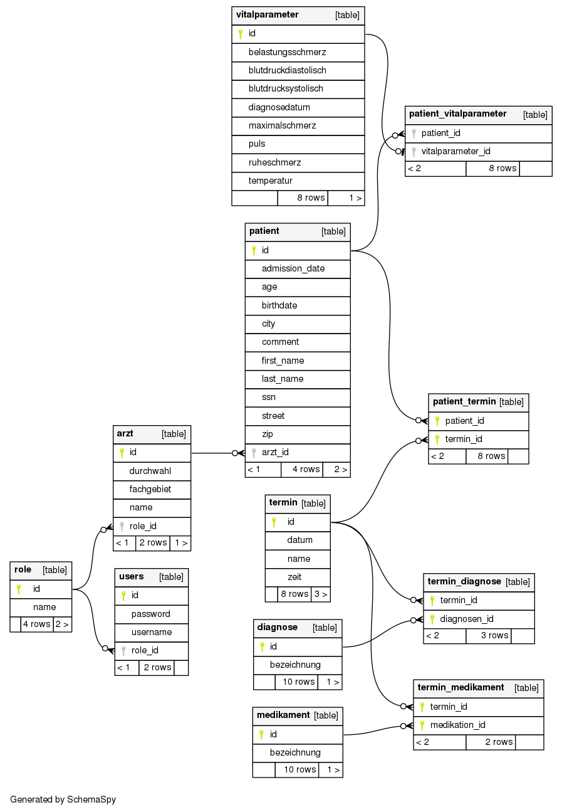

## Setup

* git clone

* Eclipse: File - Import - Maven - Existing Maven Projects

## Deployment

* mvn clean heroku:deploy-war

## Create Database Schema Diagram
http://schemaspy.org/
<pre>
# Schemaspy 6
java -jar schemaspy-6.0.0.jar -t pgsql -dp postgresql-42.2.5.jar -db DATABASE \
-host HOSTNAME -port 5432 -s public \
-u USERNAME -p PASSWORD -o OUTPUTDIR
</pre>

