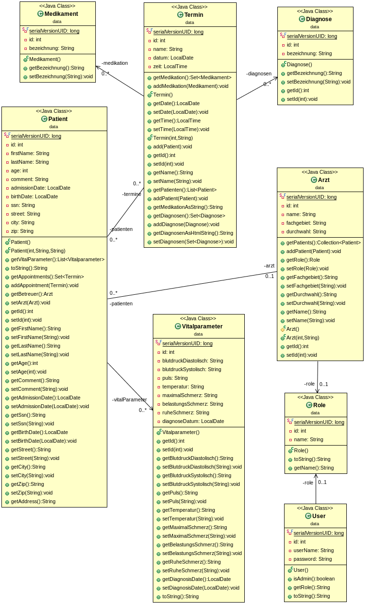

## Setup

* git clone

* Eclipse: File - Import - Maven - Existing Maven Projects

## Deployment

* mvn clean heroku:deploy-war

## Database Schema
http://schemaspy.org/

https://jdbc.postgresql.org/download.html
<pre>
java -jar schemaspy-6.0.0.jar -t pgsql -dp postgresql-42.2.5.jar -db DATABASE \
-host HOSTNAME -port 5432 -s public \
-u USERNAME -p PASSWORD -o OUTPUTDIR
</pre>

## Class Diagram

